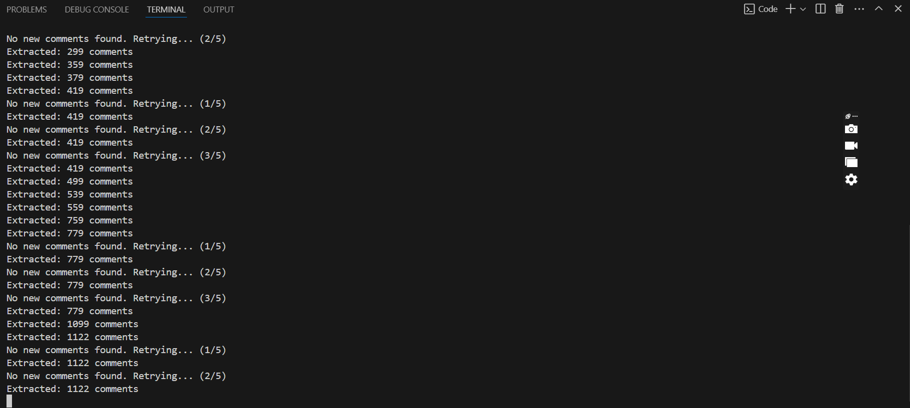

# YouTube Comments Scraper


A Python-based tool to scrape comments from YouTube videos using **Selenium**. This script extracts comments and their authors from a specified YouTube video and saves the data in a CSV file. It handles pagination and avoids duplicates, making it efficient for large-scale comment scraping.


---

## Table of Contents
- [Features](#features)
- [Installation](#installation)
- [Output](#output)

---

## Features
- **Scrape Comments**: Extract comments and their authors from YouTube videos.
- **Pagination Handling**: Automatically scrolls to load more comments.
- **Duplicate Prevention**: Ensures no duplicate comments are saved.
- **CSV Export**: Saves scraped data in a CSV file with UTF-8 encoding for proper emoji display.
- **Customizable**: Easily adjust the number of comments to scrape or retry logic.

---

## Installation
Ensure you have Python installed, then install the required dependencies:
```bash
pip install -r requirements.txt
```
### Prerequisites
- Python 3.8 or higher.
- Google Chrome browser.
- ChromeDriver (matching your Chrome version).


For more details, refer to the project documentation or raise an issue in the reposito
## Output



The script generates a CSV file (`Comment.csv`) with the following columns:
- **Author**: The username of the commenter.
- **Comment**: The text of the comment.

### Example Output in Markdown Table Format

| Author       | Comment                     |
|--------------|-----------------------------|
| JohnDoe      | Great video!                |
| JaneSmith    | Thanks for the tutorial.    |
| Alice        | This was very helpful.      |
| Bob          | Can you make more of these? |