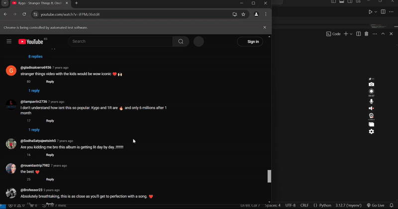

# YouTube Comments Scraper

A Python-based tool to scrape comments from YouTube videos using **Selenium**. This script extracts comments and their authors from a specified YouTube video and saves the data in a CSV file. It handles pagination and avoids duplicates, making it efficient for large-scale comment scraping.

---

## Table of Contents
- [Features](#features)
- [Installation](#installation)
- [Usage](#usage)
- [Demo](#demo)
- [Output](#output)
- [Contributing](#contributing)
- [License](#license)

---

## Features
- **Scrape Comments**: Extract comments and their authors from YouTube videos.
- **Pagination Handling**: Automatically scrolls to load more comments.
- **Duplicate Prevention**: Ensures no duplicate comments are saved.
- **CSV Export**: Saves scraped data in a CSV file with UTF-8 encoding for proper emoji display.
- **Customizable**: Easily adjust the number of comments to scrape or retry logic.

---

## Installation

### Prerequisites
- Python 3.8 or higher.
- Google Chrome browser.
- ChromeDriver (matching your Chrome version).

